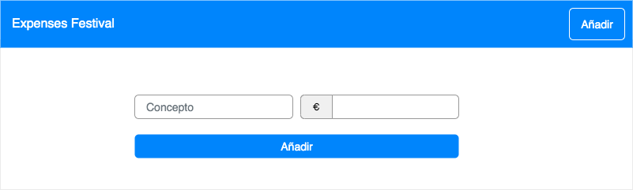
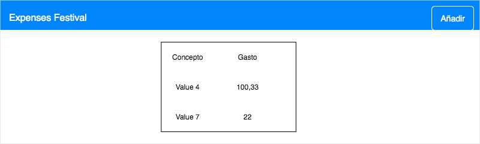

# Expenses Festival

Aplicación web para almacenar gastos.

Sólo hace eso. 

Pero es para aprender :)

Resuelto en vídeo en https://premium.danielprimo.io

## Tecnología

Tecnología para resolverlo:
- Laravel (PHP)
- Ingenio :)

## Requisitos

Construir una aplicación que almacene y muestre los gastos.

## Instalación

Debes tener un stack que te permita ejecutar PHP y MySQL.

Aquí te explico varias opciones para saber cómo hacerlo.

https://telegra.ph/Instalaci%C3%B3n-de-requisitos-para-desarrollar-con-PHP-Laravel-y-MySQL-06-18

Luego debes cargar las dependencias del proyecto:

`composer install`

`npm install & npm run dev`

También debes disponer de un fichero de variables de entorno:

`cp .env.example .env`

Y adaptar la configuración para que pueda acceder a la base de datos.

Recuerda que en Laravel siempre es conveniente ejecutar la migración para crear la estructura de la base de datos.

`php artisan migrate`

¡Disfruta del picoPala!